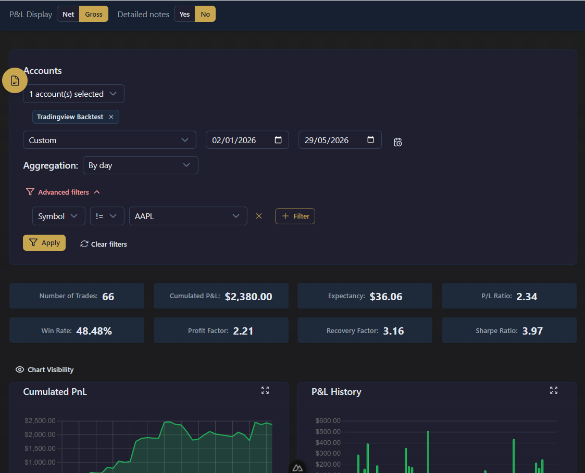
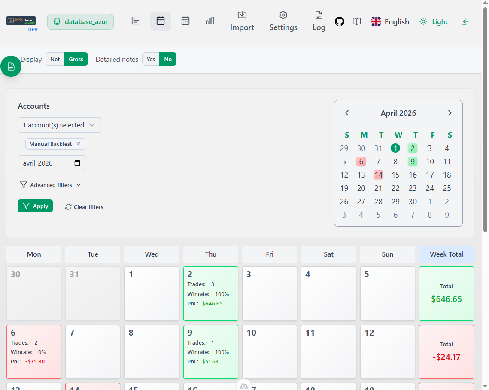

# 📊 PnlTracker - Trading Journal

**PnlTracker** is a modern trading journal web application built with Nuxt 3, allowing traders to track, analyze, and optimize their trading performance — fully local, nothing leaves your machine.

> 🚀 This project is actively evolving. New features and improvements are added regularly.

## ✨ Features

- 📈 **Trade Tracking**: Detailed recording of all your trades with P&L
- 📥 **Multi-Source Import**: MT5 (XLSX), NinjaTrader 8, Interactive Brokers, Quantower, Standard CSV, and live API connections
- 📊 **Advanced Analytics**: Performance charts (P&L, APPT, Win Rate, P/L Ratio, Sharpe Ratio, Profit Factor, Recovery Factor)
- 🗓️ **Trading Calendar**: Visualize profitable and losing days at a glance
- 📋 **Daily View**: Review trades, notes, and tags for any day
- 🏷️ **Tag System**: Organize trades by strategy, setup, or market context
- 📝 **Daily Notes**: Rich-text trading journal per day
- 📸 **Screenshots**: Attach chart images to your trades
- 🌓 **Dark/Light Mode**: Adaptable interface
- 🌍 **Multilingual**: English and French
- 📱 **Responsive**: Mobile and desktop
- 💾 **Backup/Restore**: Full database backup and restore
- 🔌 **Plugins**: Extend functionality without modifying core code
- 🏦 **Multi-Account**: Manage multiple trading accounts with starting capital tracking

<!-- 🖼️ SCREENSHOTS -->

| Dark Mode | Light Mode |
|-----------|------------|
|  |  |


> 📖 See the full documentation with screenshots and guides at [doc.pnltracker.app](https://doc.pnltracker.app)

## 🛠️ Technologies

- **Frontend**: Nuxt 3, Vue 3, TypeScript
- **UI**: Nuxt UI, TailwindCSS
- **Database**: PostgreSQL with multi-schema isolation
- **ORM**: Prisma
- **Charts**: Chart.js, ECharts, Lightweight Charts (TradingView)

## 🚀 Getting Started

> 📦 Pre-built Linux binaries are available on the [GitHub Releases](https://github.com/yopkool29/pnlTracker/releases) page. Windows and macOS builds will follow.

### Prerequisites

- **Docker** and **Docker Compose** (recommended)
- OR **Node.js 22+** and **npm** for manual installation

### Docker (recommended)

```bash
git clone https://github.com/yopkool29/pnltracker.git
cd pnltracker

# Configure environment
cp .env.production.example .env
# Edit .env to set your secrets (JWT, PostgreSQL password, admin token)
# Or use the helper to auto-generate secure secrets:
# Linux/mac: ./env-create-prod.sh
# Windows:  ./env-create-prod.ps1

# Build and start
docker compose up -d --build
```

Access the app at **http://localhost:3001**

### Local (npm)

```bash
git clone https://github.com/yopkool29/pnltracker.git
cd pnltracker
npm install

# Configure environment
cp .env.example .env
# Edit .env to set your secrets (JWT, PostgreSQL password, admin token)

# Start PostgreSQL
docker compose -f ./docker-compose.dev.yml up -d

# Generate Prisma clients
npx prisma generate --schema=prisma/auth/schema.prisma
npx prisma generate --schema=prisma/data/schema.prisma

# Initialize database and create admin
./scripts/reinit.sh

# Start dev server
npm run dev
# OR production mode
npm run build && npm start
```

### Desktop development (Tauri/Linux)

The desktop development wrapper reuses the existing Nuxt/Nitro server and an external PostgreSQL instance. Start PostgreSQL as above, configure `.env`, then run:

```bash
npm tauri:dev
```

This opens PnlTracker in a Tauri WebView while keeping the site available on port `3003` for the local MCP server. The existing web and Docker commands are unchanged.

### Post-installation checklist

- Application accessible at http://localhost:3001
- Login with `admin@mail.fr` / `admin`
- Create your first database (isolated PostgreSQL schema)
- Import your trading data

### 🔑 Default Login

- **Email**: `admin@mail.fr`
- **Password**: `admin`

## 📊 Features

### Trade Management
- Manual trade entry and editing
- Import from MT5 (XLSX), NinjaTrader 8, Interactive Brokers, Quantower
- Standard CSV import
- Live API import (NinjaTrader addon, IBKR Flex Query) and cloud storage server
- Multiple screenshots and rich text notes per trade (Milkdown editor)
- Custom trading symbols with aliases

### Analysis and Statistics
- **Interactive Charts**: P&L History, Cumulated P&L, Win Rate, APPT — draggable and customizable
- **Key Metrics**: P/L Ratio, Profit Factor, Recovery Factor, Expectancy ...
- **Net vs Gross P&L toggle**
- **Advanced Filters**: Symbol, type, date, lot, profit, tags
- **Detailed Sections**: All trades, Winning, Losing, and comparison views

### Tag System
- Customizable tag groups
- Colors and descriptions
- Advanced trade filtering by tags
- Daily / Trade tags for market context and journaling

### Local MCP server

The read-only MCP server lets compatible assistants query PnlTracker through its HTTP API. PnlTracker and PostgreSQL must already be running.

Set these values in `.env` (copy them from **Settings → Options → MCP** in the app):

```bash
PNLTRACKER_API_URL=http://127.0.0.1:3001
PNLTRACKER_MCP_TOKEN=your-user-api-token
```

The token must match the PnlTracker user's API token. For the initial administrator, it matches `ADMIN_API_TOKEN`. Start the server manually with `npm mcp`, or use the project configuration in `.devin/mcp_config.json` from a compatible MCP client.

The MCP exposes databases, accounts, tags, global daily notes, active closed trades and aggregated performance. Trade details include allowlisted risk/reward, option metadata and detailed notes. It cannot modify data and does not expose screenshots, arbitrary metadata or open positions.

Example questions:

- What is my net P&L this month?
- Which symbols have the lowest profit factor?
- Break down my performance by weekday.

## 🤝 Contributing

1. Fork the project
2. Create a feature branch (`git checkout -b feature/AmazingFeature`)
3. Commit your changes (`git commit -m 'Add some AmazingFeature'`)
4. Push to the branch (`git push origin feature/AmazingFeature`)
5. Open a Pull Request

## 📝 License

This project is licensed under the Apache 2.0 License. See the [LICENSE](LICENSE.txt) file for details.

> ☁️ The code remains open-source, but I reserve the right to offer a managed, paid cloud hosting service for the app in the future.

## 🆘 Support

- 🐛 Issues: [GitHub Issues](https://github.com/yopkool29/pnltracker/issues)
